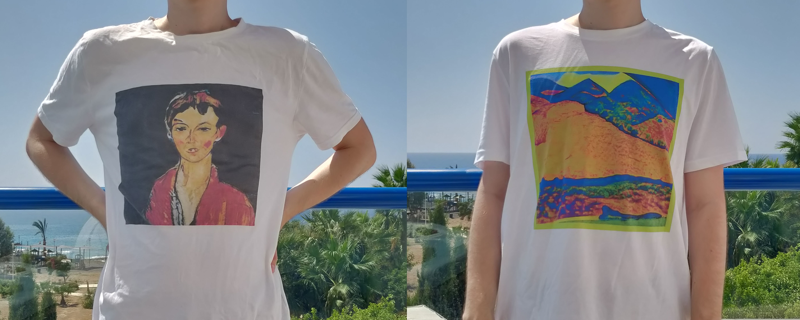

# [artee.ai](https://artee.ai)

This repo contains some models and code from artee.ai project - endless AI Generated Tees store.

T-Shirt designs and captions were generated using neural networks. Each time updating the page, a unique design is obtained.
Any t-shirt can be ordered by clicking on it. Tees printed in UK using Teemill service and delivered worldwide.

## StyleGAN model

[COLAB DEMO](https://colab.research.google.com/drive/1GK5MD94PBBkRAbrJ3Zkln3O_maHUTGQA)

A high-quality generative model is the heart of our product. So we started with research in this direction. t is obvious that the quality will depend on two things - algorithm and data. 

As an algorithm we decided to use StyleGAN ([original NVIDIA's repo link](https://github.com/NVlabs/stylegan)), since it generates high-resolution images (1024 x 1024) and it was proved that it works for different domains (tons of this[soemthing]doesnotexists sites).

As a dataset, we used [subset of wikiart styles](https://github.com/VladimirGl/artee.ai) and [The Museum of Modern Art dataset](https://github.com/MuseumofModernArt/collection). We have removed low-quality images, crop non-square images and it gave us a final dataset of about 40.000 images.

You can check how our model works using [colab](https://colab.research.google.com/drive/1GK5MD94PBBkRAbrJ3Zkln3O_maHUTGQA) or `pytorch_stylegan_art.ipynb` notebook.

## Google Cloud

We use google cloud products as a backend for our store. We don't want to generate designs on the fly, because it is expensive to have GPU instance always up. Instead of this we pre-generate hundreds of thousands of designs with all required meta and store them on google cloud storage. Also, we have a google cloud firestore database with information about products. So we try not to show t-shirts which have already been ordered. f our database runs out we will just generate new designs.

We have two API endpoints (code in gcloud folder):
* get_products - returns the list of 12 t-shirts with all required meta
* get_product_url - generate URL for custom teemill product, so a user can order t-shirt

Both endpoints use google cloud functions, so we have fully serverless and scalable architecture.

## Some URL's

* [artee.ai](https://artee.ai)
* [model weights](https://storage.googleapis.com/artee/model.pt)
* [producthunt product page](https://www.producthunt.com/posts/ai-generated-tees)
* [teemill store](https://artee-ai.teemill.com)
